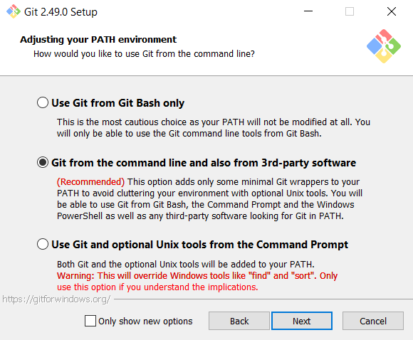

# Common WPF Template

## Description
This project was implemented in class, and the goal is to modify and enhance its features.

## Usage
To clone and use this project in Visual Studio:
1. Install Git (remember to add Git to your system's PATH by selecting the option shown below; click "Next" on the remaining setup pages).

   

2. Verify Git installation:  
   - Open a command window and enter `git --version`.  
   - You should see the installed Git version displayed.

3. Clone the repository and run the project by double-clicking the `.sln` (solution) file.

## Contact
If you have any questions, please contact your TAs. Good luck!
